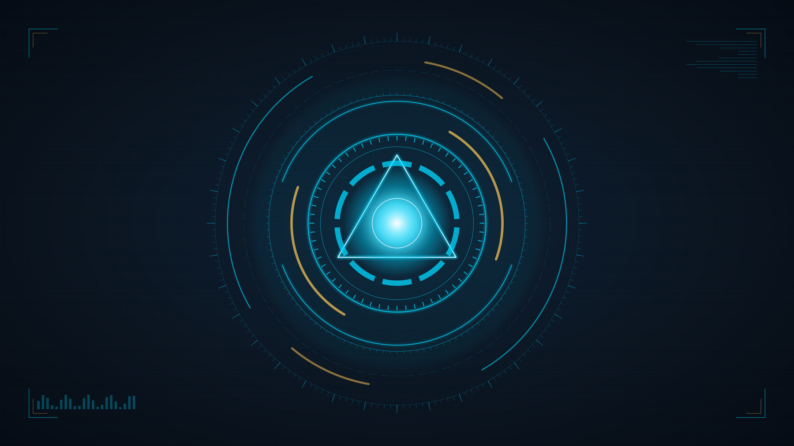

# JARVIS — an Omarchy theme

Stark Industries HUD for [Omarchy](https://omarchy.org): deep navy glass,
arc-reactor cyan, hot-rod gold. Active window borders sweep from cyan to gold.



## Install

```bash
omarchy-theme-install https://github.com/HashMaster02/omarchy-jarvis-theme.git
```

The installer clones this repo into `~/.config/omarchy/themes/jarvis` and
applies it. Switch back any time with `omarchy theme set <name>` or the
theme picker.

## What's included

- `colors.toml` — the palette Omarchy uses to build every terminal, editor,
  bar and notification theme
- `backgrounds/` — two 4K wallpapers: the arc reactor and a horizon glow
- `unlock.png` — lock-screen wordmark
- `icons.theme` — icon theme name (`Yaru-blue`)
- `keyboard.rgb` — keyboard backlight colour, for keyboards Omarchy can drive
- `src/` — generator scripts for every asset above, so the wallpapers and the
  fastfetch logo can be regenerated or tweaked (see `src/README.md`)

## Updating

```bash
cd ~/.config/omarchy/themes/jarvis && git pull && omarchy theme set jarvis
```
