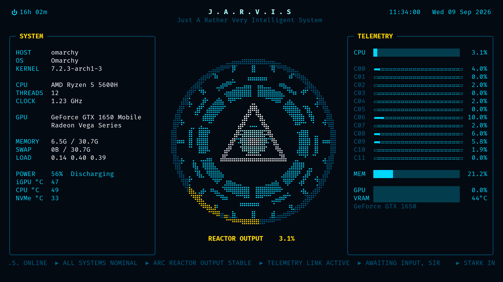

# JARVIS screensaver

A live-telemetry screensaver: an animated arc reactor (braille-rendered, so it
rotates smoothly) flanked by hardware info on the left and CPU, per-core,
memory and GPU meters on the right. Exits on any key, like Omarchy's own.



## Install

```bash
~/.config/omarchy/themes/jarvis/screensaver/install.sh
```

Then try it with `jarvis-launch-screensaver force`, or wait for idle.

The installer copies two scripts into `~/.local/bin`, clones Omarchy's idle
plugin into `~/.config/omarchy/plugins/<you>.idle` with its screensaver hook
pointed at JARVIS, adds a Screensaver entry to the Omarchy menu, and restarts
the shell. Run it again after `git pull` to pick up updates. Pass `--link` to
symlink the scripts instead of copying, so edits in this folder apply live.

Needs only Python 3 (already on Omarchy). Temperatures come from `sensors`
(`lm_sensors`) and the discrete-GPU panel from `nvidia-smi`; both are optional.

## Uninstall

```bash
~/.config/omarchy/themes/jarvis/screensaver/uninstall.sh
```

## Files

- `jarvis-screensaver` — the curses program (stdlib only)
- `jarvis-launch-screensaver` — Omarchy's launcher, pointed at the program above;
  opens a fullscreen terminal with class `org.omarchy.screensaver` on every monitor
